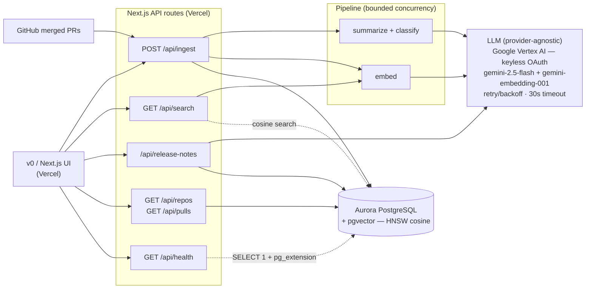

# ReleaseIQ — Architecture

AI release-intelligence on the **Vercel v0 + AWS Databases** stack. A repo's merged PRs are
summarized, classified, and embedded by an LLM, then stored in **Aurora PostgreSQL + pgvector**
for semantic "what changed and why" search and auto-generated release notes.

## Data flow

1. **Ingest** (`POST /api/ingest`) — fetches merged PRs from GitHub (or accepts them in the body),
   then for each PR (in bounded-concurrency batches, per-PR failures isolated): an LLM **summarizes +
   classifies** it (`feat`/`fix`/`perf`/`docs`/`chore`/`breaking`, `customer`/`internal`) and **embeds**
   the summary; the row + 1536-d vector is upserted into Postgres.
2. **Search** (`GET /api/search`) — embeds the query and runs a **pgvector cosine** search (HNSW index),
   returning ranked PRs with change-type, audience, and PR link.
3. **Release notes** (`/api/release-notes`) — POST generates grouped Markdown notes from the stored PR
   summaries via the LLM; GET returns the latest stored note.
4. **Browse** (`/api/repos`, `/api/pulls`) — ingested repos with PR counts, and per-repo PR lists.
5. **Health** (`/api/health`) — DB connectivity + pgvector readiness probe.

## Stack notes

- **Frontend/deploy:** Next.js 15 (App Router) on Vercel.
- **DB:** Amazon Aurora PostgreSQL with `pgvector` 0.8 (HNSW cosine index), live in production via the
  Vercel AWS Marketplace integration (IAM/OIDC, no connection string). A free **Neon** Postgres is used
  as a local dev stand-in (`selectConnectionMode()` picks `url` → `iam` → `none`).
- **AI:** provider-agnostic LLM facade selectable via `LLM_PROVIDER` (OpenAI-compatible *or* Vertex).
  Production runs **Google Vertex AI** — `gemini-2.5-flash` (summarize/classify) + `gemini-embedding-001`
  (1536-d embeddings via the native `:predict` API). **Keyless auth:** a service-account JWT is signed
  locally (`node:crypto`) and exchanged for a short-lived OAuth token — no static key in the request path.
  Hardened: transient-failure retry with backoff, `Retry-After`, single-flight token minting, clipped
  error bodies; embeddings are batched (one `:predict` call per concurrency window); 30s request timeout.
- **Auth, both halves:** keyless — Aurora via AWS IAM/OIDC (RDS token), Vertex via SA-JWT → OAuth.
- **Verification:** 118 tests (unit + PGlite integration against real pgvector), CI-gated at 80% coverage.
